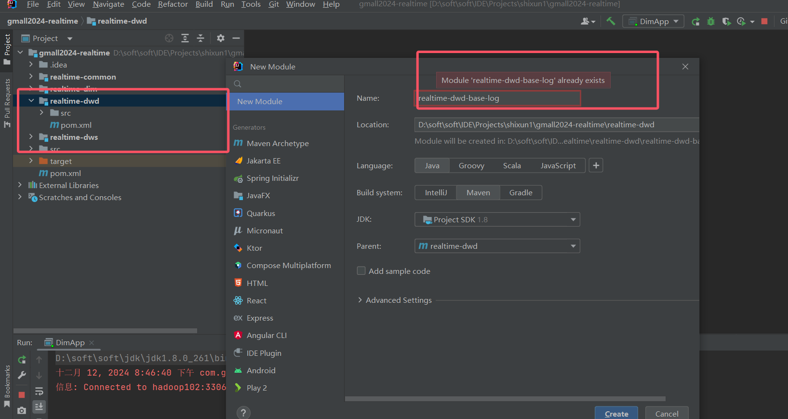
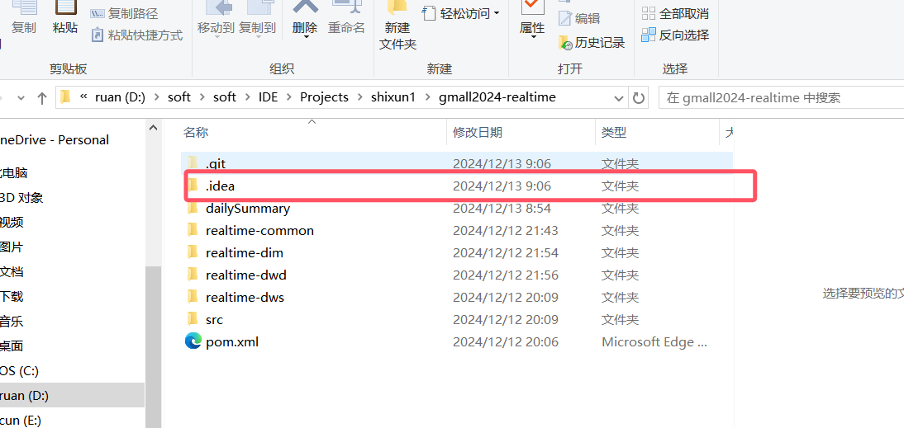

ods: flume采集log数据
     maxwell采集业务数据
dim:
realtime-common模块的基类baseApp和一些Hbase Jdbc 的方法
    realtime-dim模块 
        广播流建维度表到hbase成功（其中数据插入不进 已经解决）
dwd:
   建立‘realtime-dwd-base-log’子模块的时候 显示子模块已经存在
   解决办法:
 将目录下面的.idea 删除重新打开项目就好了