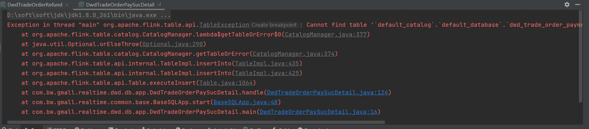

dwd层:  运行时显示checkpoint检查点无写入权限，但是基类里边的checkpoint我已经关闭了
  解决办法:删除了项目下的.idea文件和iml结尾的文件 重新加载了项目
完成了:
   dwd-base-log,dwd-interaction-comment-info,dwd-trade-cart-add,dwd-trade-order-cancel-detail
,dwd-trade-order-detail，realtime-dwd-trade-order-pay-suc-detail 等子模块的搭建和代码的完成 已经将代码提交到了github

但是其中有两个需要和order-detail一起执行但是报错

还未能解决 

**问题总结:**
  存到hbase的维度表根据op字段 也就是状态来进行判断 还有就是根据表名进行判断 sink_table字段
和hbase同样是kv结构的还有redis 
hbase为什么适合储存维度表
1. 高效读写性能
   随机读取：HBase 支持快速的随机读取操作，这对于频繁查询维度表中的特定记录非常有利。
   批量写入：当需要更新大量维度信息时，HBase 可以提供高效的批量写入能力

**广播流**
广播流的使用场景
动态规则更新：例如，在实时日志分析中，你可能有一个规则流来定义哪些类型的日志应该被过滤或标记为异常。这些规则可能会频繁变化，因此将其作为广播流可以确保所有处理任务都能立即应用最新的规则。
配置参数：如果你的应用程序需要根据某些配置参数调整其行为，比如窗口大小、阈值等，那么可以通过广播流将这些参数传递给所有的处理任务。
全局状态同步：对于需要跨多个分区共享的状态信息，广播流提供了一种高效的方式来进行同步。

 **数据倾斜 :**
数据倾斜的概念和影响  :数据倾斜是指在数据处理过程中，数据分布不均匀，
导致部分任务处理的数据量远远大于其他任务。例如，在分布式计算环境下
，如 MapReduce、Spark 等，数据被划分到不同的分区或任务中进行处理。如果数据倾斜发生，
会使得某些任务的处理时间大幅增加，从而延长整个数据处理流程的时间。
严重的数据倾斜可能还会导致内存不足、节点崩溃等问题，影响系统的稳定性和性能。

**解决方案**

- **数据预处理**
    - **采样和分析数据**：在进行大规模数据处理之前，先对数据进行采样。通过随机抽取一定比例的数据样本，分析数据的分布情况。例如，在一个电商数据处理场景中，对用户订单数据进行采样，查看不同地区、不同商品类别等维度下订单数据的分布。如果发现某些地区的订单数据量远远超过其他地区，就可以预测在后续处理中可能出现数据倾斜。
    - **数据过滤和重分布**：根据采样分析的结果，对数据进行预处理。如果发现少量的特殊值（如某个热门商品的订单量异常高）导致数据倾斜，可以在数据预处理阶段将这些特殊值进行单独处理，或者对数据进行重新分布。例如，将热门商品订单数据划分到多个分区中，而不是让一个分区单独处理所有热门商品订单。
- **调整分区策略**
    - **自定义分区函数（以 Spark 为例）**：在 Spark 中，对于 RDD（弹性分布式数据集）或 DataFrame 的分区操作，可以自定义分区函数来实现更合理的数据划分。假设处理用户购买数据，原始分区可能是基于用户 ID 进行划分。如果发现数据倾斜是因为少数高消费用户的数据量过大，可以设计一个新的分区函数，根据用户的消费金额区间进行分区。这样可以将高消费用户的数据分散到多个分区中，避免一个分区的数据量过大。
    - **使用哈希分区和范围分区结合的方式**：哈希分区可以将数据均匀地分布到不同的分区中，但有时候单纯的哈希分区可能无法满足复杂的数据分布需求。可以结合范围分区，先根据数据的某个范围特征（如时间范围、数值大小范围等）进行初步分区，然后在每个范围分区内再使用哈希分区。例如，在处理日志数据时，先按照日期范围进行分区，然后在每个日期范围内，使用哈希分区将日志数据根据用户 ID 等其他因素进一步划分。
- **使用随机化技术**
    - **添加随机前缀或后缀**：对于导致数据倾斜的关键数据列（如订单数据中的热门商品 ID），可以在数据处理之前添加随机的前缀或后缀。例如，在处理包含热门商品的订单数据时，给热门商品 ID 添加一个随机的数字前缀，然后在后续的处理过程中，根据这个带有随机前缀的商品 ID 进行分组或其他操作。这样可以将原本集中在一个组的数据分散到多个组中，减轻数据倾斜。
    - **数据重排**：通过对数据进行随机重排，打乱数据的原有分布，使得数据在处理过程中更加均匀地分配到各个任务中。例如，在一个分布式排序任务中，如果某些数据值出现的频率过高导致数据倾斜，可以对数据进行随机重排，然后再进行排序操作，这样可以降低数据倾斜对排序过程的影响。
- **聚合操作优化**
    - **局部聚合再全局聚合**：在进行数据聚合操作（如求和、计数、平均值计算等）时，先在数据产生倾斜的局部范围内进行聚合。例如，在处理销售数据时，如果某些店铺的销售额数据量巨大导致数据倾斜，可以先在店铺内部进行销售额的初步聚合，得到店铺的总销售额等信息，然后再将这些局部聚合后的结果进行全局聚合。这样可以减少参与全局聚合的数据量，降低数据倾斜的影响。
    - **使用近似算法**：在一些对精度要求不是极高的场景下，可以使用近似算法来代替精确的聚合算法。例如，在计算海量数据的平均值时，使用基于采样的近似平均值计算方法，而不是对所有数据进行精确计算。这样可以在一定程度上减轻数据倾斜对聚合操作的影响，同时也能快速得到一个近似的结果。